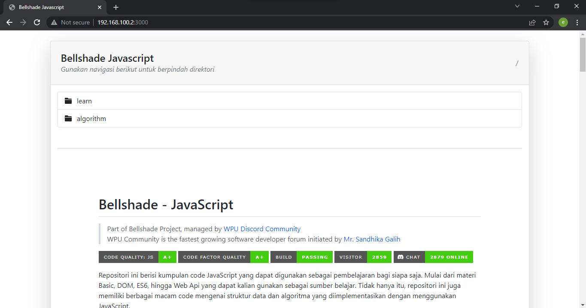
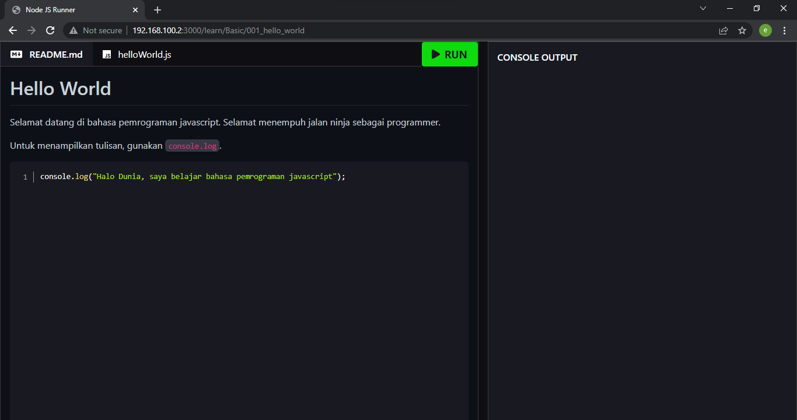
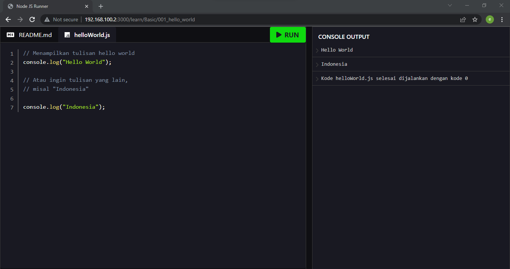
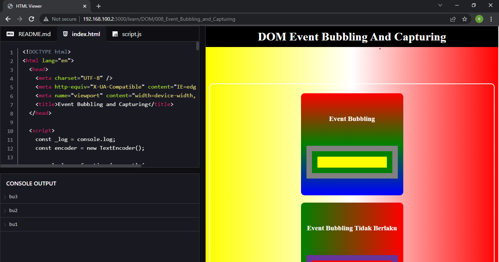

# `@bellshade/ningali`

[Ningali](https://id.wiktionary.org/wiki/ningali) berasal dari Bahasa Sunda halus yang berarti `melihat`, jadi package ini bertujuan agar orang yang menggunakannya bisa melihat folder pembelajaran yang sudah dibuat sebelumnya kedalam tampilan web. Dalam kata lain package ini adalah penyaji materi dari filesystem ke tampilan web.

## Fitur-Fitur

Pertama-tama, fitur package ini bisa menampilkan readme dari semua folder dari mulai direktori root sampai ke anakannya.



Readme juga bisa ditampilkan di folder yang berisikan sebuah materi.



Kedua, materi yang berisikan kode yang bisa ditampilkan dan dijalankan bisa di eksekusi dengan menekan tombol `Run` yang nantinya akan dijalankan oleh node js di server.



Ketiga, ketika folder berisikan kode html otomatis akan disajikan html tersebut kedalam iframe, nilai yang keluar dari `console.log` akan ditampilkan ke console web.



## Penggunaan

### Inisialisasi Server

Buatlah sebuah file terlebih dahulu, semisal `server.js`. Pacakge ini membutuhkan sebuah parameter yang berupa `object` yang konfigurasinya sebagai berikut.

```js
const ningali = require("@bellshade/ningali");

const app = ningali({
  /* Berisikan folder apa saja yang ingin dimasukan
   * untuk selanjutnya bisa disajikan. Dibawah ini
   * adalah contoh implementasi untuk Bellshade
   * Javascript
   */
  folders: ["learn", "algorithm"],

  /* Mendefinisikan apa judul yang nantinya ingin
   * ditampilkan kedalam webnya, contohnya adalah
   * "Bellshade Javascript"
   */
  title: "Bellshade Javascript",
});
```

### Bekerja dengan HTML

Supaya console browser berfungsi, diperlukan sebuah snippet tambahan supaya `console.log` dari si html bisa ditangkap oleh ningali. Tambahkan snippet dibawah ini ke dalam `head` dari html kamu.

```html
<script>
  const _log = console.log;
  const encoder = new TextEncoder();

  console.log = function (...rest) {
    window.parent.postMessage(
      {
        source: "iframe",
        message: rest.map((d) => encoder.encode(d)),
      },
      "*"
    );
    _log.apply(console, arguments);
  };
</script>
```
